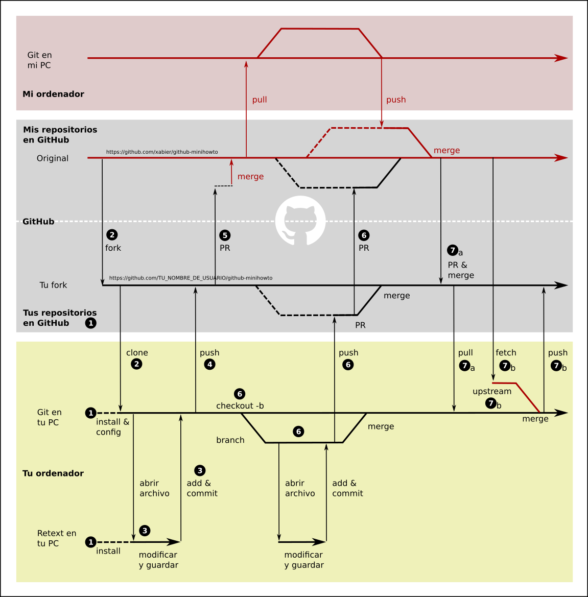
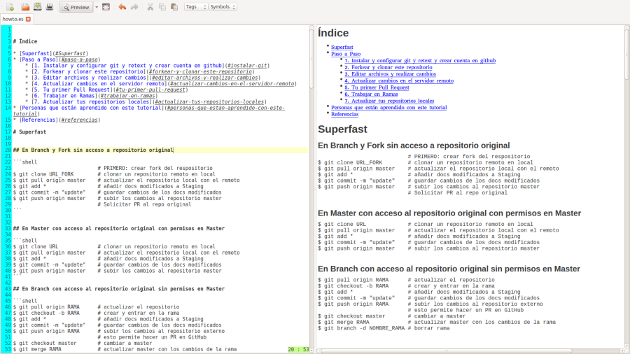
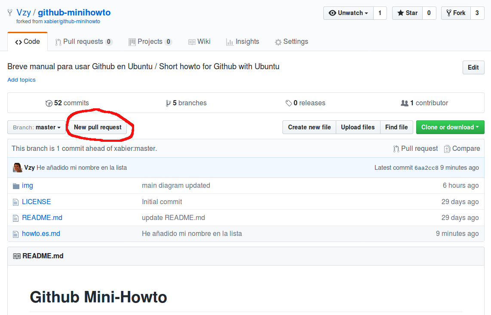
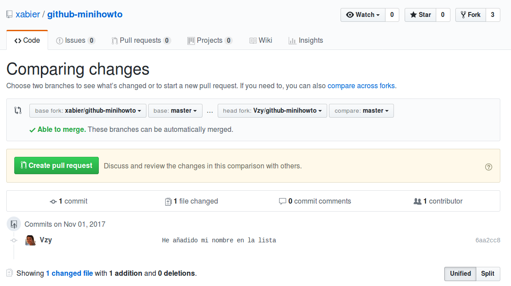
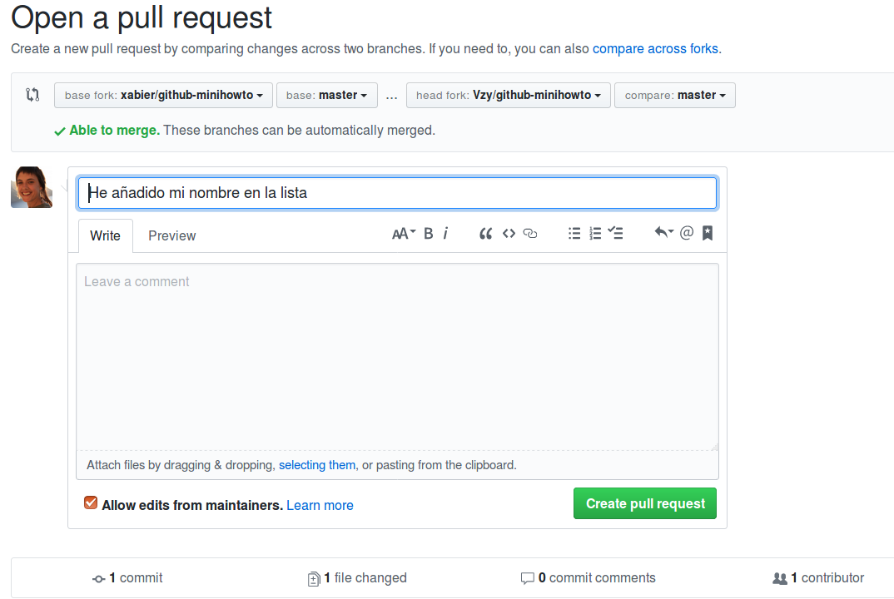

# Manual práctico de introducción a Git y GitHub

Bienvenida/o, este es un breve pero intenso manual para introducirte en el mundo del código colaborativo a través de tres herramientas básicas: la red social [GitHub](https://github.com), la tecnología Git y el lenguaje de marcas Markdown (que usaremos a través del editor Retext). La inmensa mayoría de los textos que hay en GitHub (manuales, documentos de acogida, notas, discusiones, etc.) se realizan con este lenguaje Markdown. 

Lo que aprenderás con este manual no es más que la punta del iceberg de un mundo tan complejo y sofisticado como maravilloso y estimulante. Con estos primeros pasos podrás romper la barrera de acceso más dura a este mundo que habitualmente requiere conocimientos previos que en este manual no damos por sabidos.

Este es el fruto de mi propio aprendizaje y no encontré ninguna guía que pudiera acompañarme en los primeros y engorroso pasos. Espero que te sirva de ayuda y que podamos mejorarla conjuntamente :)

Este manual está pensado para practicar con el propio manual y colaborar con él, editando y contribuyendo a este mismo documento que estás leyendo ahora. Dependiendo de tu nivel de conocimientos previos y destreza con la línea  de comandos, este recorrido de aprendizaje debería de llevarte entre una y cuatro horas intensas de trabajo. Al final del mismo habrás contribuido a este manual de manera práctica y serás capaz de contribuir a cualquier otro texto que se encuentre en Github, crear los tuyos propios y abrir y gestionar procesos de colaboración. Merece la pena.

# Índice

- [Manual práctico de introducción a Git y GitHub](#manual-pr%C3%A1ctico-de-introducci%C3%B3n-a-git-y-github)
- [Índice](#%C3%ADndice)
- [Referencia rápida](#referencia-r%C3%A1pida)
    - [Trabajando en master](#trabajando-en-master)
    - [Trabajo en ramas](#trabajo-en-ramas)
- [Paso a paso](#paso-a-paso)
    - [1. Instalar y configurar Git y Retext y crear una cuenta en Github](#1-instalar-y-configurar-git-y-retext-y-crear-una-cuenta-en-github)
    - [2. Forkear y clonar este repositorio](#2-forkear-y-clonar-este-repositorio)
    - [3. Editar archivos y realizar cambios](#3-editar-archivos-y-realizar-cambios)
    - [4. Actualizar cambios en el servidor remoto](#4-actualizar-cambios-en-el-servidor-remoto)
    - [5. Tu primer Pull Request](#5-tu-primer-pull-request)
        - [Paso 1](#paso-1)
        - [Paso 2](#paso-2)
        - [Paso 3](#paso-3)
    - [6. Trabajar en Ramas](#6-trabajar-en-ramas)
    - [7. Actualizar o sincronizar tus repositorios locales](#7-actualizar-o-sincronizar-tus-repositorios-locales)
        - [7.a. Sincronizar tu fork en Github y luego en local](#7a-sincronizar-tu-fork-en-github-y-luego-en-local)
        - [7.b. Sincronizar repositorios desde tu PC con Git](#7b-sincronizar-repositorios-desde-tu-pc-con-git)
    - [8. Usar `ssh` en lugar de `https` para sincronizar repositorios](#8-usar-ssh-en-lugar-de-https-para-sincronizar-repositorios)
- [Referencias](#referencias)
- [Personas que están aprendiendo con este tutorial](#personas-que-est%C3%A1n-aprendiendo-con-este-tutorial)


# Referencia rápida

Puedes saltar esta sección, sirve de referencia rápida (a modo de chuleta) una vez hayas realizado todos los pasos del tutorial.

## Trabajando en master

```shell
                            # PRIMERO: crear fork del repositorio
$ git clone URL_FORK        # clonar un repositorio remoto en local
$ git pull origin master    # actualizar el repositorio local con el remoto
$ git add *                 # añadir docs modificados a Staging
$ git commit -m "update"    # guardar cambios de los docs modificados
$ git push origin master    # subir los cambios al repositorio master
                            # Solicitar PR al repo original
$ git remote -v             # comprobar repositorios remotos declarados
$ git remote add upstream URL_ORIGINAL # añadir repositorio original 
$ git fetch upstream        # actualizar los cambios del repo original
$ git merge upstream/master # fusionar nuestro master local con el original
$ git status                # comprobar estado de cambios y rama actual
```

## Trabajo en ramas

```shell
$ git pull origin RAMA      # actualizar el repositorio local con RAMA remoto
$ git checkout -b RAMA      # crear y entrar en la rama
$ git push origin RAMA      # subir los cambios al repositorio externo
                            # esto permite hacer un PR en GitHub
$ git checkout master       # cambiar a master
$ git merge RAMA            # actualizar la rama en la que estamos con RAMA
$ git branch -d RAMA        # borrar rama
$ git status                # comprobar estado de cambios y rama actual
```


# Paso a paso

A continuación te muestro un diagrama con los pasos que vamos a ir dando en el tutorial. No te asustes con la complejidad del diagrama. Iremos paso a paso y el diagrama te servirá como referencia para ordenar todas las acciones que vamos a realizar.

En el diagrama diferenciamos tres espacios de trabajo: arriba del todo (en rosa) mi ordenador, abajo del todo (en amarillo) el tuyo, en medio GitHub (en gris). Dentro de Github y separados por una línea discontinua blanca diferenciamos el espacio de tus repositorios y del mío. Las flechas en rojo indican las acciones, archivos y repositorios que me tocan a mi, en negro lo que vas a crear y hacer tú. Las bolitas negras con números dentro indican las acciones que realizarás en las secciones numeradas de este manual.



Aunque ahora mismo el diagrama tenga demasiado detalle para ti que acabas de empezar, podemos comenzar a usarlo para comprender la lógica básica de trabajar con Git y con Github. 

La idea fundamental que captura el diagrama es que en Git y en Github trabajamos con repositorios de documentos (que fundamentalmente contienen carpetas y documentos de texto). Para simplificarlo todo imaginemos que sólo hay un documento (este mismo, cuyo nombre es `howto.es.md`). Las líneas horizontales representan la historia de de este repositorio (p.e. las diferentes versiones del documento), cada vez que modificamos algo en un documento se creará una nueva versión y nos deslizamos hacia la derecha en la líneas horizontales. 

Para el caso que nos ocupa existen cuatro versiones fundamentales de este documento que lees ahora (`howto.es.md`): la que está en mi ordenador (la línea superior roja), la que está en mi cuenta de github (segunda línea roja), la que vas a crear en tú dentro de Github (primera línea negra) y finalmente la que vas a tener en tu ordenador. También existirá una versión (que se muestra en la última línea discontinua abajo del todo). Esta línea, que aparece dos veces, es una copia temporal en tu ordenador. Es la copia que se crea cada vez que abres el editor de textos `retext`, la memoria RAM retendrá la copia de los cambios que vas realizando en el archivo. Cuando le das a guardar, esta versión se copia en la carpeta y modifica el archivo original. De aquí que la última "línea" que  hay en el diagrama sea discontinua (porque sólamente existe temporalmente mientras editas el texto).

<<<<<<< HEAD
Si no la tienes aún [create una cuenta en github](https://github.com/join?source=login).
=======
Las líneas diagonales que salen de las horizontales para volver a juntarse con ella se llaman ramas (`branch` en inglés). Las líneas verticales son, fundamentalmente, acciones orientadas descargar repositorios, o a subir o actualizar copias. En tu caso, cada vez que una flecha vaya de arriba-abajo indicará que te estas descargando algo o actualizando tus documentos con los repositorios o versiones de una línea de orden superior. Cuando la flecha vaya de abajo-arriba será que guardas un cambios o empujas un cambio de un repositorio a otro de orden superior.
>>>>>>> fc68fdd873aa4e11d93efafe96a2b278596b958b

Por ahora basta con que comprendas esta lógica fundamental y comencemos paso a paso a completar las acciones del diagrama.

**Nota para principiantes en la terminal y la línea de comandos:** Probablemente no seas una persona familiarizada con la línea de comandos. Todas las instruccoines que damos aquí son a través de la línea de comandos, tambiné llamada consola o terminal (que es la forma de dar órdenes a tu ordenador de manera directa, sin interfaz gráfica). Lo primero que tienes que hacer es abrir una terminal, lo encontrarás sin problemas en tu menú de aplicaciones. Está por defecto en todas las distribuciones de GNU/Linux y en Ubutu. La virtud de este tutorial (como muchos otros) es que se pueden cortar y pegar los comandos que se muestran directamente en tu terminal. Al pegar en la terminar tienes que utilizar la combinación de teclas `Ctrl+Shift+v` en lugar del más común `Ctrl+v` . Además ten en cuenta que el símbolo del dolar `$` indica que estás en la terminal, no lo tienes que copiar. En algunos comandos aparece un texto explicativo precedido del símbolo de la almoadilla  (`#`). No importa que copies y pegues las cadenas de texto que explican un comando, ya que cuando van precedidas del símbolo de la almoadilla no se van a ejecutar, la línea de comandos los ignora. Puedes aprender más sobre la terminal consultando los enlaces que hay en [la sección de referencias](#referencias).


## 1. Instalar y configurar Git y Retext y crear una cuenta en Github

Instala Git y Retext en Ubuntu con los siguientes comandos (al introducir cualquier comando precedido de la orden `sudo` (que significa que el super usuario o administrador/a del sistema quien ejecuta el comendo) la terminal te pedirá tu password de usuario de Ubuntu. Para evitar que alguien pueda averiguar tu contraseña o saber el número de dígitos que contiene, la línea de comandos no pone los típicos asteriscos mientras escribes tu contraseña):

```shell
$ sudo apt-get install git-all  # Instalar git
$ sudo apt-get install retext   # Instalar editor Retext
```

`Retext` nos va a servir par poder editar archivos en lenguaje Markdown (como este mismo, si necesitas una introducción conceptual a Markdown puedes consultar [esta guía introductoria a Markdown](https://github.com/xabier/escritura-colaborativa-github/blob/master/lenguajes-de-marca.md), y [aquí puedes consultar una guía de referencia rápida en castellano para la sintaxis de Markdown](http://joedicastro.com/pages/markdown.html), puedes utilizar cualquier otro editor, incluso un editor de texto plano.

Si no las tiene aún [create una cuenta en github](https://github.com/join?source=login).

Usa tu nombre de usuario de GitHub para configurar la autoría de tus cambios:

```shell
$ git config --global user.name "TU_NOMBRE"
```

Define una dirección de correo electrónico (preferiblemente la que usaste para tu cuenta de Github):

```shell
$ git config --global user.email "TU_CORREO_ELECTRONICO"
```

Ahora vas a crear una carpeta donde vas a almacenar todos los repositorios con los que trabajarás en Github a partir de ahora. Para crearla directamente en la home ejecutamos los siguientes comandos en la terminal:

```shell
$ cd                    # Volver a Home (directorio raíz de la usuaria)
$ mkdir repos-git       # crear directorio o carpeta "repos-git"
```

## 2. Forkear y clonar este repositorio

Empezar con este repositorio no es tan fácil como empezar de cero porque este repositorio no es tuyo, tú no puedes contribuir directamente aquí. Pero empezar sin un repositorio propio tampoco es fácil (ni te permite colaborar con otras personas). Así que las cosas serán un poquito más complicadas al principio pero un poco más fáciles después. Estos son los pasos que vamos a dar:

a) Vas a crear un `fork` de este repositorio, un fork es una copia con la que podrás trabajar directamente, ya que este fork o copia será tuya, y en tus propio repositorio no tienes que pedir permiso a nadie.


Ahora que ya tienes tu fork puedes clonar y descargarte el repositorio a tu ordenador y comenzar a trabajar. Para ello tienes que volver a la terminal y ejecutarás estos comandos:

```shell
$ cd ~/repos-git        # con esto nos movemos a nuestra carpeta de repositorios
$ git clone https://github.com/TU_NOMBRE_DE_USUARIO/github-minihowto
```

Sustituyendo tu ```TU_NOMBRE_DE_USUARIO``` por tu nombre de usuario en Github. Ahora podrás comprobar que en la carpeta ```repos-git``` tienes ya la carpeta o directorio en el que has descargado el repositorio remoto

```shell
$ ls                    # lista los directorios que hay
                        # verás que aparece github-minihowto
$ cd github-minihowto   # para moverse a la nueva carpeta
```

También puedes abrir y editar los archivos desde el navegador de carpetas con el que seguramente estás más familiarizada.

Ya estamos preparadas para editar archivos y contribuir.


## 3. Editar archivos y realizar cambios

Volvemos a la línea de comandos. Ahora vas a editar la copia que hay en tu ordenador, del fork que has hecho en Github, de este documento `howto.es.md`. Para ello ejecutamos el siguiente comando (que básicamente le dice al programa `retext` que abra el documento): 

```shell
$ retext howto.es.md
```

Como verás, Retext es un editor de textos, más sencillo que LibreOffice o Word. Pero es un editor de texto plano. Lo que permite Retext, a diferencia de otros editores de texto plano (sin formatear), es ver en tiempo real cómo se formatea Markdown. Para eso tienes que activar la visualización en pantalla partida, a la izquierda verás el código de Markdown y a la derecha cómo queda visualmente. Para ello haz click en el icono siguiente y activa la opción `live preview` que sale cuando le das al botón desplegable:


Ahora deberías de poder ver una imagen similar a esta:



Ya puedes comenzar a editar el texto. Te propongo que comiences por una edición muy sencilla: incluir tu nombre al final de este documento. Añade tu nombre, precedido del símbolo del asterisco `*` debajo del último de la fila y cierra la aplicación `Retext`.

Ahora podemos usar un comando de git muy socorrido, porque nos ayuda a saber cuál es la situación actual de cambios:

```shell
$ git status
```

La terminal debería de darte la siguiente información:

```
On branch master
Changes not staged for commit:
  (use "git add <file>..." to update what will be committed)
  (use "git checkout -- <file>..." to discard changes in working directory)

	modified:   howto.es.md

no changes added to commit (use "git add" and/or "git commit -a")
```
Lo que te está indicando Git es que has realizado cambios que no has incluido aún en el fichero de referencia o control de cambios (llamado `HEAD` o `staging`) y que no te has "comprometido" con ningún cambio, que no los has registrado o guardado en Git.

Ahora vas a avisar a git de que has realizado cambios en ese archivo:

```shell
$ git add howto.es.md
```

Si has modificado varios documentos puedes añadir todos a la vez con el comando:

```shell
$ git add *
```

**Nota**: El símbolo del asterisco se utiliza en la línea de comandos como una variable que cubre todas las posibilidades, osea para indicarlo todo, usalo con mucha precaución.

Con esto lo que hemos conseguido es añadir los cambios a `HEAD` o `staging`, que es el índice de los archivos modificados, pero aún no hemos "guardado" esos cambios. Para eso tenemos que realizar un commit:

```shell
$ git commit -m "He añadido mi nombre en la lista"
```

El texto entrecomillado es el mensaje con el que se guardarán dichos cambios explicando a terceros cual es, en resumen, la aportación o modificaciones que has realizado.


## 4. Actualizar cambios en el servidor remoto

Lo que queremos hacer ahora es empujar (`push`) nuestros cambios en local (en nuestro ordenador) a la rama maestra (`master`) que está en nuestro repositorio forkeado en github, para eso hacemos:

```shell
$ git push origin master
```

La propia línea de comandos te pedirá tu nombre de usuario y tu password en Github.

Enhorabuena, acabas de actualizar tu repositorio en Github con los cambios que has realizado. Puedes visitarlos en la siguiente dirección web: `https://github.com/TU_NOMBRE_DE_USUARIO/github-minihowto` (recuerda sustituir tu nombre de usuario). Es un buen momento para que explores algunas de las múltiples características de Github: el control de versiones, los hashes o códigos de integridad de las versiones, etc.

Te aconsejo que re-visites el diagrama para identificar los pasos que has realizado hasta ahora, ya has avanzado mucho y podrás ver cómo se relacionan los diferentes niveles en el diagrama. También debería de ser capaz de identificar los diferentes comandos con las diferentes acciones del diagrama.

## 5. Tu primer Pull Request

Ahora vamos a realizar tu primer Pull Request o PR: pedir que incorporen tus mejoras en el original del que forkeaste, para que este manual quede actualizado con los cambios que has realizado en tu fork. Si visitas tu repositorio forkeado verás que aparece un botón que te permitirá hacer le PR al original en tres pasos.


### Paso 1

Vete al repositorio de tu fork en `https://github.com/TU_NOMBRE_DE_USUARIO/github-minihowto` (recuerda sustituir tu nombre de usuario) y pulsa el botón `New pull request` tal y como aparece en esta imagen:




### Paso 2

Ahora ya puedes crear el Pull Request pulsando el botón verde que pone `Create pull request`.




### Paso 3

Ahora sólo te queda abrir un hilo en el que podrás añadir más comentarios si fueran necesarios, si no, puedes dejar todo en blanco y pulsar directamente el botón `Open pull request` que se muestra en esta imagen:



A partir de aquí entrarás en una fase de revisión o discusión del PR, puede que te pida que hagas más cambios, o corregir errores, o nada. En un momento dado aceptaré tu PR y habrás contribuido satisfactoriamente a este manual :smile: **¡Enhorabuena!**

Podrás ver las [estadísticas de contribución aquí y encontrar tus contribuciones](https://github.com/xabier/github-minihowto/graphs/contributors).

Es un buen momento para volver al diagrama y revisar una vez más estos últimos pasos, y los siguientes, porque vamos a entrar a trabajar en ramas que en el diagrama verás como vías paralelas que vuelven a juntarse con las líneas principales, también llamadas ramas maestra o `master`.


## 6. Trabajar en Ramas

Hasta ahora has modificado los archivos de la carpeta original de tu fork, lo que se llama rama maestra o `master`. Sin embargo, también puedes trabajar sobre una versión temporal que tenga un nombre propio y que recoja todo un conjunto de cambios. A esto se le llama una rama. Por ejemplo podrías querer actualizar todas las capturas de pantalla de este tutorial o crear una versión en inglés. Puedes crear una rama e introducir las nuevas capturas o traducciones al inglés, ir añadiendo commits a esa rama. Durante este tiempo puede que alguien modifique el documento, pero con suerte tu rama no se ve afectada porque sólo estabas actualizando las capturas de pantalla u otra versión en inglés que no afecta a este documento. 

Cuando terminas de realizar los cambios puedes fusionar la rama (`merge`) con la versión en la rama maestra, tanto en local como en el repositorio original a través de un PR que incluirá todas las modificaciones que hayas realizado en tu rama. Si no hay conflictos la nueva rama podrá contribuir directamente al repositorio y la rama (o tronco) `master`.

Para empezar primero tenemos que crear una rama, tendrás que escoger el nombre de la rama que vas a crear:

```shell
$ git checkout -b NOMBRE_RAMA
```

Con este comando no sólo hemos creado la rama sino que nos hemos movido a ella. Todos los archivos que editemos de ahora en adelante, todos los cambios, se guardarán sólo dentro de esta rama. Es importante saber en qué rama estamos trabajando en cada momento, por lo que es conveniente ejecutar el comando `git status`:

```shell
$ git status
```
Y debería de darte la siguiente salida:

```shell
On branch NOMBRE_RAMA
nothing to commit, working directory clean
```

Ahora realizas los cambios que correspondan en los archivos que quieras. Por ejemplo podrías añadir nuevos archivos a la carpeta `img/`.

Ahora para subir (empujar, push) la rama con sus cambios al repositorio remoto hacemos:

```shell
$ git push origin NOMBRE_RAMA
```

Ahora si quieres fusionar tu rama con la maestra. Primero tendrás que cambiar a la rama maestra:

```shell
$ git checkout master
```

Y desde aquí ya puedes fusionar (merge) la rama nueva a la rama maestra:

```shell
$ git merge NOMBRE_RAMA
```

Para no acumular ramas es recomendable borrarlas una vez estén completadas:

```shell
$ git branch -d NOMBRE_RAMA
```


## 7. Actualizar o sincronizar tus repositorios locales

Si hay cambios en los servidores remotos y tienes que actualizar tu repositorio local. Con este comando actualizarás tu repositorio local con el repositorio master de github

```shell
$ git pull origin master
```

Lo que no hemos conseguido con el comando anterior son dos cosas fundamentales: 1. actualizar tu fork con el original mio, 2. actualizar tu copia en local con el original

Existen dos vías para resolver este problema: a) primero actualizar o sincronizar tu fork en github y luego descargar en local, o, b) hacerlo directamente en local.

### 7.a. Sincronizar tu fork en Github y luego en local

<<<<<<< HEAD
* Xabier, Carolina
=======
Lo que tienes que hacer para sincronizar (actualizar tu repositorio) tu fork con el original es ir a tu Fork y realizar un Pull Request en la dirección original --> fork. Para debes realizar los siguientes pasos:

1. Haz click en `Pull Request`
2. Cambia la base, por defecto Github considerará que los PR se hacen de tu fork al original, pero lo que queremos hacer es justamente lo contrario para poder actualizar nuestro repositorio forkeado. Así que haz click en `switching the base`
3. Haz click en `Create Pull Request` y luego en `Send Pull Request`
4. Baja hacia abajo para hacer `Merge`

Ya tienes tu repositorio fork actualizado con el original. Ahora, para actualizar tu repositorio local, basta con que hagas lo siguiente:

```shell
$ git pull origin master
```

### 7.b. Sincronizar repositorios desde tu PC con Git

Primero vamos a incluir el repositorio original (que vamos a llamar `upstream`) como uno de los repositorios remotos. Ten en cuenta que, hasta ahora desde tu PC, sólo tienes referenciado tu Fork, no mi repositorio original.

Primero, para comprobar qué repositorios remotos tienes declarados hacemos:

```shell
$ git remote -v     # comprobar repositorios remotos declarados
```
El resultado que te tiene que salir es:

```shell
origin https://github.com/TU_NOMBRE_DE_USUARIO/github-minihowto (fetch)
origin https://github.com/TU_NOMBRE_DE_USUARIO/github-minihowto (push)
```

Ahora metemos el repositorio original como upstream:

```shell
$ git remote add upstream https://github.com/xabier/github-minihowto
```

Al volver a revisar los repositorios declarados verás lo siguiente:

```shell
$ git remote -v
origin https://github.com/TU_NOMBRE_DE_USUARIO/github-minihowto (fetch)
origin https://github.com/TU_NOMBRE_DE_USUARIO/github-minihowto (push)
upstream https://github.com/xabier/github-minihowto (fetch)
upstream https://github.com/xabier/github-minihowto (push)
```

Ahora vas a actualizar tu repositorio local con el original

```shell
$ git fetch upstream        # actualizar los cambios del repo original
```
>>>>>>> fc68fdd873aa4e11d93efafe96a2b278596b958b

Pero aún no has fusionado tu repositorio local con las actualizaciones del original. Para ello hacemos:

```shell
$ git checkout master       # para estar seguros de estar en la rama maestra
$ git merge upstream/master # con esto fusionamos nuestro master local con el original
```

También podrías ejecutar el comando `git pull upstream`. Básicamente el comando `pull = fetch + merge` por lo que te ahorras un paso, pero entonces perderías los cambios que has realizado en local porque `pull` los sobre-escribe, de ahí que se recomiende hacer `fetch` para actualizar y poder seguir trabajando sin perder los cambios en local. Esto es particularmente interesante si trabajas con ramas.

## 8. Usar `ssh` en lugar de `https` para sincronizar repositorios

Ya has aprendido lo fundamental. Esta sección simplemente te hará la vida más cómoda a la hora de sincronizar (hacer `push`, `pull`, etc.) los repositorios locales y remotos. Hasta ahora hemos utilizado el protocolo `https` para esta tarea. Es el mismo protocolo de navegación segura por internet que utilizar tu navegador web. Sin embargo nos obliga a introducir la clave de usuario cada vez que sincronizamos en la dirección local->remoto. Repetir esta tarea es cansino y existe una manera de resolverlo: utilizar un tunel cifrado con contraseñas guardadas en local para no tener que introducir la contraseña cada vez. Es el método `ssh`.

Lo primero que tienes que hacer es crear una clave ssh en tu ordenador. Se almacenan todas en el directorio `.ssh` y quizás tengas ya una creada así que vamos a comprobarlo:

```shell
$ cd ~/.ssh       # para movernos al directorio (carpeta) ssh
$ ls              # para ver el conentido
```

Si el último comando muestra algún documento que termine en `.pub` ya tienes creada una clave y la puedes usar para sincronizarte con GitHub y puede saltarte el siguiente paso. Sino, deberás crear una clave:

```shell
$ ssh-keygen -t rsa -b 4096 -C "TU_CORREO@LOQUESEA.NET" # genera la clave
```

Te pedirá dónde guardar la clave, pulsa enter para que te la guarde en su lugar por defecto que es la carpeta `.ssh`. A continuación te pedirá un password o passphrase. Como la seguridad es muy importante tienes que escoger una buena frase-clave.

Ahora queremos que el uso de ssh sea lo más automático posible para evitar tener que meter la frase-clave todo el rato. Para ello contamos con `ssh-agent` un programa que nos ayuda precisamente con eso. 

```shell
$ eval "$(ssh-agent -s)"    # Activamos el agente
$ ssh-add ~/.ssh/id_rsa     # Añade la clave-ssh a gestionar por el agente
```

Ahora sólo falta añadir la clave a GitHub para que nos reconozca como usuario fiable y nos permita sincronizarnos. [Sigue estas instrucciones](https://help.github.com/articles/adding-a-new-ssh-key-to-your-github-account/).

Ahora nos queda un último paso. Si comenzamos desde el comienzo con la sincronización con `ssh` no es ningún problema, porque al hacer el primer `clone` le diremos a Git que vamos a trabajar siempre con `ssh` y la cosa va rodada. Por ejemplo el primer clone del fork de este repositorio sería:

```shell
git clone git@github.com:TU_NOMBRE_USUARIO/github-minihowto.git
```

El problema es que hemos hecho todo con `https` hasta ahora y queremos cambiar a `ssh`. Si es el caso, vamos a la terminal, navegamos hasta la carpeta del proyecto git y ejecutamos los siguientes comandos:

```shell
$ git remote -v     # para ver cómo tenemos asociados los servidores remotos
$ git remote set-url origin git@github.com:TU_USUARIO/github-minihowto.git
```

Repetimos esta operación cambiando `remote` por `upstream` en caso de que tengamos también otros servidores remotos activados (esto nos lo habrá mostrado el comando `git remote -v`)

Y ya está! A partir de ahora cuando hagamos cualquiera de los comandos que exijan sincronización con el servidor remoto no tendremos que meter la frase-clave de ssh más que la primera vez y podemos olvidarnos de tener que meter usuario y password cada vez que hagamos `git pull` :)

# Referencias

* Markdown
    * http://joedicastro.com/pages/markdown.html 
	* https://github.com/adam-p/markdown-here/wiki/Markdown-Cheatsheet
	* https://daringfireball.net/projects/markdown/syntax
* Github
    * https://guides.github.com/activities/hello-world/
* Git y Github
	* https://services.github.com/on-demand/downloads/github-git-cheat-sheet/
	* https://rogerdudler.github.io/git-guide/
	* https://blog.udacity.com/2015/06/a-beginners-git-github-tutorial.html
* SSH y Github
    * https://help.github.com/articles/connecting-to-github-with-ssh/ 
* Terminal o consola en Ubuntu:
    * http://www.ubuntu-guia.com/2009/07/comandos-basicos-de-linux.html
    * https://www.genbeta.com/linux/linux-paso-a-paso-los-cinco-comandos-para-la-terminal-que-todo-usuario-de-ubuntu-debe-conocer
    * https://computernewage.com/2013/04/04/primeros-pasos-con-la-terminal-de-linux/

# Personas que están aprendiendo con este tutorial

* Xabier
* Vzy
* elaragon
* kelete
* imi
